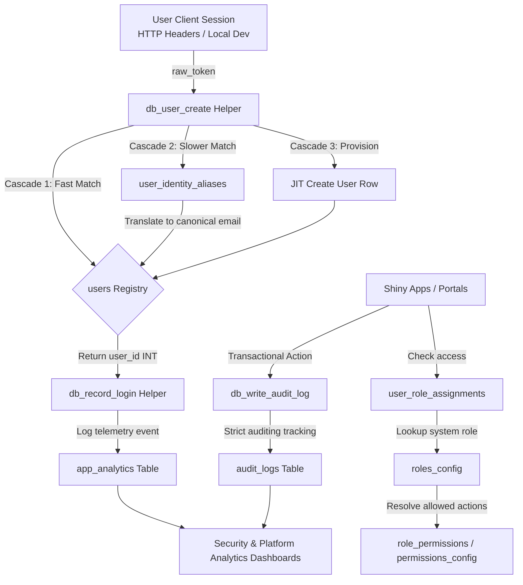
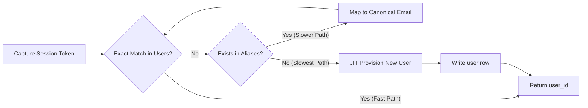
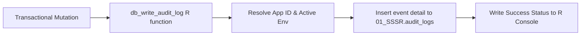

# Data Flow — Application Infrastructure, Security & Auditing (SSSR)

This document describes the end‑to‑end data flow, schemas, ERDs, and identity resolution pipelines that support universal application configurations, user directories, permissions, telemetry logging, and security auditing under the `01_SSSR` schema.

## High-Level Flow
1. **Request Lifecycle:** Active session headers initialized via Posit Connect, ShinyProxy, or local development environments.
2. **Identity Verification & JIT Provisioning:** The identity resolution engine maps user string tokens or network aliases to unique internal user IDs.
3. **Authorization & RBAC/ABAC Checks:** The active session resolves user privileges using a granular application-permission matrix.
4. **Active Application Operations:** The user interacts with business portals (e.g., Significant Change Portal, SLIC, Hubs Portal).
5. **Universal Log Generation:** Applications stream active navigation traces to clickstream telemetry and record database alterations to unified audit ledgers.
6. **Telemetry Analytics Reporting:** Security dashboards and operational trackers ingest the logs to evaluate system utilization and ensure strict compliance.

---

## System Architecture (Mermaid - view on GitHub)



Diagrams
SSSR Core Architecture ERD (Mermaid - view on GitHub)
```mermaid
erDiagram
    users {
        INT user_id PK
        NVARCHAR username "NULL"
        NVARCHAR email "UK, NOT NULL"
        DATETIME2 created_at "NOT NULL"
    }

    user_identity_aliases {
        NVARCHAR username_alias PK
        NVARCHAR email_address "NOT NULL"
        DATETIME2 created_at "NOT NULL"
    }

    roles_config {
        INT role_id PK
        NVARCHAR role_name "UK, NOT NULL"
        NVARCHAR friendly_name "NOT NULL"
        NVARCHAR description "NULL"
    }

    permissions_config {
        INT permission_id PK
        NVARCHAR permission_name "UK, NOT NULL"
        NVARCHAR friendly_name "NOT NULL"
        NVARCHAR description "NULL"
    }

    role_permissions {
        INT role_id PK, FK
        INT permission_id PK, FK
    }

    user_role_assignments {
        INT assignment_id PK
        INT user_id FK, "NOT NULL"
        INT role_id FK, "NOT NULL"
        INT app_id FK, "NOT NULL"
        BIT is_active "NOT NULL"
        DATETIME2 assigned_at "NOT NULL"
        INT assigned_by FK, "NOT NULL"
        DATETIME2 revoked_at "NULL"
        INT revoked_by FK, "NULL"
    }

    apps_config {
        INT app_id PK
        NVARCHAR app_name "NOT NULL"
        NVARCHAR app_description "NULL"
        NVARCHAR app_url "NULL"
        NVARCHAR linking_table "NULL"
        NVARCHAR linking_column "NULL"
        BIT is_active "NOT NULL"
    }

    environments_config {
        TINYINT env_id PK
        NVARCHAR env_name "UK, NOT NULL"
        NVARCHAR friendly_name "NOT NULL"
    }

    app_analytics {
        INT analytics_id PK
        INT user_id FK, "NOT NULL"
        INT app_id FK, "NOT NULL"
        TINYINT env_id FK, "NOT NULL"
        DATETIME2 event_timestamp "NOT NULL"
        NVARCHAR page_name "NOT NULL"
        NVARCHAR action_type "NOT NULL"
        NVARCHAR action_sub_type "NULL"
    }

    audit_logs {
        BIGINT audit_id PK
        INT app_id FK, "NOT NULL"
        INT user_id FK, "NOT NULL"
        TINYINT env_id FK, "NOT NULL"
        NVARCHAR action_type "NOT NULL"
        NVARCHAR target_table "NOT NULL"
        NVARCHAR record_id "NULL"
        NVARCHAR action_summary "NOT NULL"
        DATETIME2 created_date "NOT NULL"
    }

    users ||--o{ user_role_assignments : "user_id"
    users ||--o{ user_role_assignments : "assigned_by"
    users ||--o{ user_role_assignments : "revoked_by"
    roles_config ||--o{ user_role_assignments : "role_id"
    apps_config ||--o{ user_role_assignments : "app_id"
    
    roles_config ||--o{ role_permissions : "role_id"
    permissions_config ||--o{ role_permissions : "permission_id"
    
    users ||--o{ app_analytics : "user_id"
    apps_config ||--o{ app_analytics : "app_id"
    environments_config ||--o{ app_analytics : "env_id"
    
    users ||--o{ audit_logs : "user_id"
    apps_config ||--o{ audit_logs : "app_id"
    environments_config ||--o{ audit_logs : "env_id"
```
Source Data
Core Platform Config & Security Schema — 01_SSSR
[01_SSSR].[users]: Master corporate user registry mapping canonical accounts to a unique tracking integer identifier.

[01_SSSR].[user_identity_aliases]: Lookup index mapping diverse single sign-on or environment token strings to their verified email addresses.

[01_SSSR].[roles_config]: Reference catalog tracking active access tiers across the platform ecosystem.

[01_SSSR].[permissions_config]: Fine-grained authorization tokens mapped to distinct interface features.

[01_SSSR].[role_permissions]: Relationship junction connecting configuration rules to designated platform roles.

[01_SSSR].[user_role_assignments]: Application permissions matrix verifying active access scopes. Features soft-delete audit hooks.

[01_SSSR].[apps_config]: Master inventory tracking deployed applications, routing addresses, and connection targets.

[01_SSSR].[environments_config]: Isolated identifiers segmenting Local Development, Test/QA, and Production run environments.

[01_SSSR].[app_analytics]: Standardized tracking database capturing internal navigation actions and user event triggers.

[01_SSSR].[audit_logs]: High-fidelity transactional database audit ledger detailing structural table mutations.

Technical Workflows
Identity Resolution & Just-In-Time Onboarding Pipeline
Purpose: Convert raw username or email string tokens safely into normalized user_id integer primary keys at session startup before rendering active UI.

Run Cadence: Executed dynamically inside Shiny server initialization hooks via dauPortalTools::db_user_create().

Process Flow:


D -- No (Slowest Path) --> F[JIT Provision New User] --> G[Write user row] --> C
Extract: Intercept token string inputs via active directory connection headers or local workspace environment properties.

Fast-Path Check: Evaluate if the input directly matches an existing record inside [01_SSSR].[users]. If a match occurs, return the user_id.

Alias Evaluation: Fall back to [01_SSSR].[user_identity_aliases] if unmatched to resolve corporate shorthands to target email accounts.

Provision: If completely new, execute an automated insert into [01_SSSR].[users], setting default parameters and returning the identity key.

Transactional Auditing Framework
Purpose: Record all row insertions, balance changes, or structural record mutations across production datasets to maintain a complete historical trace.

Process Flow:



Trigger: A database mutation query executes inside an active user dashboard session.

Context Enrichment: The package evaluates the context to determine the calling app_id and execution env_id (e.g., Development vs. Production).

Log Execution: The application executes a structured insert to [01_SSSR].[audit_logs], recording the modified table, targeted record primary key, execution type, and details of the operation.

Outputs
Unified Access Security Logs: Comprehensive system review sheets used to audit user permissions across the environment.

Usage Performance Dashboards: Clickstream analytics metrics reporting active user volume trends.

Access Matrix Control Blocks: Administrative control panels used to update, add, or soft-delete assignments dynamically without altering code.